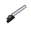
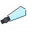
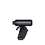
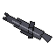
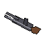
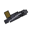
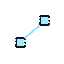
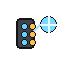

# トリガー武器仕様書

WorldTrigger Mod — Weapon Specification v1.5

---

## 凡例

| 用語 | 説明 |
|---|---|
| 威力 | 1発あたりのトリオンダメージ量（実数値） |
| 消費トリオン | 1回の発動で消費するトリオン量（実数値） |
| 装備コスト | 装備しているだけで実効トリオン総量から差し引かれる値 |
| クールダウン | 次の発動まで待つ時間（tick単位。20tick = 1秒） |
| 通常発動 | 持っている手のクリックで発動する基本アクション |
| 特殊発動 | Shift＋右クリックで発動する追加アクション |
| 特殊スキル | 持っているだけで自動発動するパッシブ効果 |

---

## 共通ルール

### トリオン容量と回復

| 項目 | デフォルト値 | 備考 |
|---|---|---|
| 基礎トリオン量 | **500** | `config.yml` の `player.base_trion` で変更可 |
| 自動回復 | **10 / 秒** | `game.trion_regen: true` / `trion_regen_per_second` で調整可 |

- トリオンが 0 になるとベイルアウト（死亡→リスポーン）
- リスポーン・ログイン時はトリオンが全回復する

### 装備スロット

| スロット | 装備方法 | 説明 |
|---|---|---|
| オフハンド（盾スロット） | ホットバーで選択して **F キー** | 左手武器。**左クリック**で発動（通常発動のみ） |
| ホットバー（選択中スロット） | スクロールで切り替え | 右手武器。**右クリック**で発動 |
| オプショントリガースロット（×6） | インベントリ画面でドラッグ | オプション系専用枠。**数字キー1〜6**で発動 |

- 両手武器をホットバーで選択中は、オフハンドの武器が自動的にインベントリに退避する（満杯の場合はドロップ）
- 装備武器が多いほど実効トリオン総量が減少し、攻撃力倍率も低下する
- 全武器パラメータは `config/worldtrigger/config.yml` で変更可能

### 発動方式

| 種別 | 操作 | 説明 |
|---|---|---|
| 通常発動 | 持っている手のクリック | 右手武器→右クリック、左手武器→左クリック |
| 特殊発動 | **Shift＋右クリック** | 右クリック固定。左手武器では使用不可 |
| 特殊スキル | 持っているだけで自動発動 | 装備中に毎tick バフ/デバフが適用。手放すと即解除 |

### スコープ（ADS）

銃系・スナイパー系武器をホットバーで選択し、**オフハンドが空の状態で左クリックを押し続ける**とスコープを覗ける。

| 分類 | ズーム倍率 |
|---|---|
| ガンナー系 | 約2.4倍 |
| スナイパー系 | 約5.5倍 |

> 離すと元の視野角に戻る。左手に何かを持っている場合はスコープ不可。

---

## ⚔️ アタッカー系（近接ブレード型）

近接戦を主体とするブレード型トリガー。射程にトリオンを割かない分、消費効率が良くトリオン量の少ない隊員にも扱いやすい。

---

### 弧月

| 威力 | 射程 | 消費トリオン | 両手/片手 | クールダウン | 装備コスト |
|---|---|---|---|---|---|
| 8 | 3m（旋空6m） | 5 | 片手 | 10 tick | 5 |

**概要**：日本刀型の万能ブレード。攻撃力・耐久力・軽さのバランスが優秀で、ボーダー内で最も使用率が高い。

**通常発動**：斬撃（3m）

**特殊発動**：旋空（射程を2倍に延長した斬撃、6m）

**特殊スキル**：抜刀強化 — 装備中に移動速度が上がる（Speed I）

> 旋空は通常斬撃と同じモーションで、射程だけが2倍になる。

---

### スコーピオン

| 威力 | 射程 | 消費トリオン | 両手/片手 | クールダウン | 装備コスト |
|---|---|---|---|---|---|
| 6 | 2m | 5 | 片手 | 8 tick | 4 |

**概要**：形状を自由に切り替えられる変形ブレード。特殊発動で全方位を同時に薙ぎ払う。

**通常発動**：前方斬撃（弧月より短射程・低ダメージだが高速）

**特殊発動**：全方位斬撃（周囲360°の全敵を同時攻撃）

**特殊スキル**：衝撃吸収 — 装備中に落下ダメージが発生しない（Slow Falling）

---

### レイガスト

| 威力 | 射程 | 消費トリオン | 両手/片手 | クールダウン | 装備コスト |
|---|---|---|---|---|---|
| 5（剣）/ —（盾） | 2m（剣）/ —（盾） | 5 | 片手 | 12 tick（剣） | 6 |

**概要**：盾と剣の中間形状。攻撃と防御を特殊発動で切り替えられる唯一のブレードトリガー。アタッカー用武器の中で最重量。

**通常発動**：
- 剣モード：斬撃（2m）
- 盾モード：バリア展開（被ダメージ35%軽減、持続3秒）

**特殊発動**：剣モード⇔盾モードの切り替え

**特殊スキル**：重装 — 装備中に移動速度が低下する（Slowness I）

> バリアの軽減率はシールドより低い（シールド:50%、レイガスト:35%）が、剣との切り替えが可能なため応用範囲が広い。

---

## 🔫 ガンナー系（銃型）

銃を使ってトリオン弾を射出する。シューター系と同じ弾を使うが、銃を介することで射程が延長される代わりに発射パラメータは固定となる。

オフハンドが空の状態で**左クリックを押し続けると約2.4倍のスコープ（ADS）**が有効になる。

---

### ハンドガン

| 威力 | 射程 | 消費トリオン | 両手/片手 | クールダウン | 装備コスト |
|---|---|---|---|---|---|
| 5 | 50m | 4 | 片手 | 12 tick | 4 |

**概要**：コンパクトな拳銃型。片手で運用できるためアタッカーやオールラウンダーがサブ武器として装備することが多い。

**通常発動**：射撃1発

**特殊発動**：3連射（威力×0.7、弾速×1.2）

**特殊スキル**：なし

> ガンナー系銃型の中で唯一の片手武器。弧月との同時装備が可能。

---

### アサルトライフル

| 威力 | 射程 | 消費トリオン | 両手/片手 | クールダウン | 装備コスト |
|---|---|---|---|---|---|
| 5 / 発 | 100m | 5 | 両手 | 8 tick | 6 |

**概要**：連射型の突撃銃。ガンナー内で最も使用率が高い標準的な銃型トリガー。

**通常発動**：射撃1発

**特殊発動**：5連射（威力×0.6、弾速×1.3、微拡散）

**特殊スキル**：なし

> アステロイド・ハウンド・バイパーなど、どの弾トリガーとも組み合わせ可能。

---

### ショットガン

| 威力 | 射程 | 消費トリオン | 両手/片手 | クールダウン | 装備コスト |
|---|---|---|---|---|---|
| 7 × 6発（最大42） | 20m | 6 | 両手 | 20 tick | 6 |

**概要**：近距離散弾型。複数の弾を同時に発射し近距離で高いダメージを与える。

**通常発動**：散弾6発同時発射（拡散あり）

**特殊発動**：集中射撃（拡散を絞り、威力×1.5の近距離特化モード）

**特殊スキル**：なし

> 5m以内で命中した場合に近距離ボーナス（×1.5）が適用。中距離以遠では不向き。

---

### ガトリング

| 威力 | 射程 | 消費トリオン | 両手/片手 | クールダウン | 装備コスト |
|---|---|---|---|---|---|
| 6 / 発 | 80m | 10 | 両手 | 4 tick | 10 |

**概要**：高い連射速度で弾幕を張れるが、トリオン消費が非常に大きい。

**通常発動**：射撃1発

**特殊発動**：8連射（威力×0.5、弾速×1.5、拡散あり）

**特殊スキル**：重火器 — 装備中に移動速度が大幅低下（Slowness II）

> 装備コストが最大級。トリオン総量に余裕がないと継戦能力が著しく低下する。

---

### グレネードガン

| 威力 | 射程 | 消費トリオン | 両手/片手 | クールダウン | 装備コスト |
|---|---|---|---|---|---|
| 10（範囲4m） | 50m | 9 | 両手 | 30 tick | 8 |

**概要**：炸裂弾を放物線軌道で発射するグレネード砲型。遮蔽物の裏への攻撃に有効。

**通常発動**：放物線軌道の爆発弾（Slowness付与）

**特殊発動**：高速爆発弾（弾速×1.5、威力×1.2、爆発範囲×1.5）

**特殊スキル**：なし

> 着弾範囲内にスロウネスを付与する。扱いが難しく使用者は少ない。

---

## ⚡ シューター系（弾丸直接射出型）

銃を使わずにトリオン弾を直接射出する。全て片手扱い。

---

### アステロイド

| 威力 | 射程 | 消費トリオン | 両手/片手 | クールダウン | 装備コスト |
|---|---|---|---|---|---|
| 7 / 発 | 40m | 5（設置時） | 片手 | 15 tick（発射）/ 5 tick（設置） | 6 |

**概要**：空中に最大6発の弾を事前設置し、任意のタイミングで一斉発射するシューター系トリガー。

**通常発動**：設置した全弾を一斉発射（設置弾がない場合は不発）

**特殊発動**：照準先の4ブロック前方に弾を設置（最大6発）

**特殊スキル**：なし

> 設置弾は30秒で自動消滅。トリオンは設置時のみ消費。設置位置はCRITパーティクルで可視化される。

---

### メテオラ

| 威力 | 射程 | 消費トリオン | 両手/片手 | クールダウン | 装備コスト |
|---|---|---|---|---|---|
| 9（範囲3m） | 30m | 8 | 片手 | 20 tick | 7 |

**概要**：着弾時に爆発して広範囲にダメージを与える炸裂弾。

**通常発動**：爆発弾発射

**特殊発動**：高速爆発弾（弾速×2、爆発範囲×1.5）

**特殊スキル**：なし

> 爆発にトリオンを使う分、直撃ダメージはアステロイドより低い。範囲攻撃で敵を牽制・分断するのに有効。

---

### ハウンド

| 威力 | 射程 | 消費トリオン | 両手/片手 | クールダウン | 装備コスト |
|---|---|---|---|---|---|
| 5 | 40m | 5 | 片手 | 15 tick | 6 |

**概要**：目標を自動追尾する誘導弾。トリオン体への反応で追いかけるため、視界外の敵も追跡できる。

**通常発動**：追尾弾1発

**特殊発動**：追尾弾3連射（上下±10°に扇状展開）

**特殊スキル**：捕捉 — 20m以内の敵にGlowing（透視マーカー）を付与し続ける

---

### バイパー

| 威力 | 射程 | 消費トリオン | 両手/片手 | クールダウン | 装備コスト |
|---|---|---|---|---|---|
| 6 / 発 | 35m | 7 | 片手 | 20 tick | 8 |

**概要**：軌道を操作できる変則弾トリガー。通常弾のほか、左右に散らしたジグザグ弾を放てる。

**通常発動**：直進弾1発

**特殊発動**：ジグザグ弾（左・正面・右の3方向に同時発射）

**特殊スキル**：なし

---

### レッドバレット（鉛弾）

| 威力 | 射程 | 消費トリオン | 両手/片手 | クールダウン | 装備コスト |
|---|---|---|---|---|---|
| 0（Slowness III付与） | 25m | 8 | 片手 | 20 tick | 7 |

**概要**：着弾点に重石を付与して対象の動きを制限する特殊弾。シールドをすり抜ける唯一の弾。

**通常発動**：スロウネス弾（シールド貫通）

**特殊発動**：範囲スロウネス弾（着弾範囲3m内の全敵にSloness III付与）

**特殊スキル**：なし

> ダメージはゼロ。命中時に強力なスロウネス（Slowness III / 5秒）を付与する。

---

## 🎯 スナイパー系（狙撃銃型）

遠距離狙撃に特化したトリガー。トリオン量によって強化される項目が3種で異なる。

オフハンドが空の状態で**左クリックを押し続けると約5.5倍のスコープ（ADS）**が有効になる。

---

### イーグレット

| 威力 | 射程 | 消費トリオン | 両手/片手 | クールダウン | 装備コスト |
|---|---|---|---|---|---|
| 8（通常）/ 20（チャージ） | 300m | 7 | 両手 | 40 tick | 8 |

**概要**：バランス型の標準狙撃銃。スナイパー入門として最も使われる。

**通常発動**：速射（弾速×2）

**特殊発動**：チャージショット（弾速×3、威力×2.5）

**特殊スキル**：なし

**トリオン依存強化**：トリオン量が多いほど射程↑

---

### ライトニング

| 威力 | 射程 | 消費トリオン | 両手/片手 | クールダウン | 装備コスト |
|---|---|---|---|---|---|
| 5 / 発 | 200m | 6 | 両手 | 35 tick | 7 |

**概要**：弾速特化型の狙撃銃。威力は低いが弾速が非常に速く（弾速×4）、目標に当てやすい。

**通常発動**：超高速弾（弾速×4）

**特殊発動**：連続高速弾（同方向へ5発連続発射）

**特殊スキル**：なし

**トリオン依存強化**：トリオン量が多いほど弾速↑

---

### アイビス

| 威力 | 射程 | 消費トリオン | 両手/片手 | クールダウン | 装備コスト |
|---|---|---|---|---|---|
| 45（通常）/ 30＋爆破（特殊） | 400m | 9 | 両手 | 50 tick | 10 |

**概要**：威力特化型の狙撃銃。1発のダメージが非常に大きく、シールド貫通率も高い（50%貫通）。

**通常発動**：超高威力弾（威力×3、ブロック破壊半径1.5m）

**特殊発動**：爆破弾（威力×2、着弾時爆発・ブロック破壊）

**特殊スキル**：大型装備 — 装備中に移動速度が低下する（Slowness I）

**トリオン依存強化**：トリオン量が多いほど威力↑

> クールダウンが長く、射撃後の隙が大きい。一撃必殺を狙う武器。

---

## 🛡️ 防御系

---

### シールド

| ダメージ軽減率 | 消費トリオン | 両手/片手 | クールダウン | 装備コスト |
|---|---|---|---|---|
| 50%（集中75%） | 3 | 片手 | — | 3 |

**概要**：全ポジション共通の防御用トリガー。バリアを展開して被ダメージを軽減する。持続時間：3秒。

**通常発動**：バリア展開（被ダメージ50%軽減）

**特殊発動**：集中（軽減率を75%まで引き上げ、持続時間は1.5秒に短縮）

**特殊スキル**：なし

> レッドバレットは貫通する。

---

### エスクード

| 消費トリオン | 両手/片手 | クールダウン | 装備コスト |
|---|---|---|---|
| 10 | 両手 | — | 12 |

**概要**：地面から実体化した大型バリケードを生やす防御トリガー。設置後は永続する。

**通常発動**：地面に壁を設置（永続）

**特殊発動**：真下に設置した場合、上方向に強制ジャンプ（カタパルト）

**特殊スキル**：なし

> 地面・壁面からしか生やせない。移動不可。設置後は取り消しできない。挟み込みによる拘束（エスクードサンドイッチ）にも使える。

---

## 🔧 オプション系（数字キーで使用）

武器スロットとは別枠の**専用スロット（6枠）**で運用するトリガー。数字キー1〜6で発動する。

### オプションスロットの操作

| 操作 | 動作 |
|---|---|
| インベントリ画面でアイテムをドラッグ | オプション系武器のみ配置可能 |
| シフトクリック（オプションスロット→インベントリ） | アイテムをメインインベントリに戻す |
| 数字キー1〜6 | 対応スロットの武器を発動 |

---

### バッグワーム

| 消費トリオン | クールダウン | 装備コスト |
|---|---|---|
| 2 / 秒（継続） | — | 3 |

**概要**：装備中はレーダーに表示されなくなるステルス用マント型トリガー。主にスナイパーが使用。

**数字キー**：レーダー非表示のオン/オフ切り替え

> 装備中は毎秒2トリオンを継続消費する。

---

### グラスホッパー

| 消費トリオン | クールダウン | 装備コスト |
|---|---|---|
| 4 | 10 tick | 4 |

**概要**：空中に薄い足場を一時生成する機動用トリガー。

**数字キー**：向いた方向の1m先に足場を設置（5秒で消滅）

> 同時設置上限4枚。上限に達した場合は最古の足場から順に消える。

---

### スパイダー

| 消費トリオン | クールダウン | 装備コスト |
|---|---|---|
| 4 | — | 4 |

**概要**：ワイヤー状のトリガーを展開して敵の機動力を制限する。

**通常発動**：ワイヤー弾射出（命中した対象にSlowness付与）

**特殊発動**：ワイヤー網展開（周囲の全エンティティにSloeness付与）

**特殊スキル**：なし

---

### スイッチボックス

| 消費トリオン | クールダウン | 装備コスト |
|---|---|---|
| 3 | — | 5 |

**概要**：マップ上の任意の場所にトラップを設置し、任意のタイミングで起動できるトラッパー専用トリガー。

**通常発動**：爆発弾設置（低速・高スプラッシュ弾を前方へ発射）

**特殊発動**：一斉起爆（周囲の全エンティティに即時ダメージ＋ノックバック）

**特殊スキル**：なし

---

## 🧪 合成弾（コンポジットラウンド）

2種のトリガーを1発に合成した特殊弾。高度な合成技術を要する。

| 威力 | 消費トリオン | 両手/片手 | クールダウン | 装備コスト |
|---|---|---|---|---|
| 7（範囲3m） | 10 | 片手 | 20 tick | 12 |

**概要**：現在選択中のモードに応じて、異なる合成弾を発射する。モードの切り替えはラジアルメニューで行う。

### モード一覧

| # | モード名 | 効果 |
|---|---|---|
| 1 | バイパー＋メテオラ | ジグザグ軌道で飛ぶ炸裂弾（3発） |
| 2 | アステロイド＋メテオラ | 5方向同時の炸裂弾 |
| 3 | アステロイド＋ハウンド | 5方向同時の誘導弾 |
| 4 | ハウンド＋メテオラ | 追尾する炸裂弾（1発） |

### モード切り替え（ラジアルメニュー）

| 操作 | 動作 |
|---|---|
| Shift＋右クリックを長押し（約0.2秒） | ラジアルメニューを開く |
| マウスを動かす | 選択するモードを変更 |
| ボタンを離す | 選択したモードに切り替え |

---

## 📊 全武器パラメータ早見表

### アタッカー系

| 武器名 | 威力 | 射程 | 消費トリオン | 両手/片手 | CD(tick) | 装備コスト | 特殊スキル |
|---|---|---|---|---|---|---|---|
| 弧月 | 8 | 3m（旋空6m） | 5 | 片手 | 10 | 5 | Speed I |
| スコーピオン | 6 | 2m | 5 | 片手 | 8 | 4 | Slow Falling |
| レイガスト（剣） | 5 | 2m | 5 | 片手 | 12 | 6 | Slowness I |
| レイガスト（盾） | — | — | 5 | 片手 | — | 6 | Slowness I |

### ガンナー系

| 武器名 | 威力 | 射程 | 消費トリオン | 両手/片手 | CD(tick) | 装備コスト | 特殊スキル |
|---|---|---|---|---|---|---|---|
| ハンドガン | 5 | 50m | 4 | 片手 | 12 | 4 | — |
| アサルトライフル | 5/発 | 100m | 5 | 両手 | 8 | 6 | — |
| ショットガン | 7×6発 | 20m | 6 | 両手 | 20 | 6 | — |
| ガトリング | 6/発 | 80m | 10 | 両手 | 4 | 10 | Slowness II |
| グレネードガン | 10（範囲4m） | 50m | 9 | 両手 | 30 | 8 | — |

### シューター系

| 武器名 | 威力 | 射程 | 消費トリオン | 両手/片手 | CD(tick) | 装備コスト | 特殊スキル |
|---|---|---|---|---|---|---|---|
| アステロイド | 7/発 | 40m | 5（設置時） | 片手 | 15/5 | 6 | — |
| メテオラ | 9（範囲3m） | 30m | 8 | 片手 | 20 | 7 | — |
| ハウンド | 5 | 40m | 5 | 片手 | 15 | 6 | Glowing（20m内） |
| バイパー | 6/発 | 35m | 7 | 片手 | 20 | 8 | — |
| レッドバレット | 0（Slowness III） | 25m | 8 | 片手 | 20 | 7 | — |

### スナイパー系

| 武器名 | 威力 | 射程 | 消費トリオン | 両手/片手 | CD(tick) | 装備コスト | 特殊スキル |
|---|---|---|---|---|---|---|---|
| イーグレット | 8/20（チャージ） | 300m | 7 | 両手 | 40 | 8 | — |
| ライトニング | 5/発（×5） | 200m | 6 | 両手 | 35 | 7 | — |
| アイビス | 45/30＋爆破 | 400m | 9 | 両手 | 50 | 10 | Slowness I |

### 防御・オプション・合成弾系

| 武器名 | 効果/特記 | 消費トリオン | 両手/片手 | CD(tick) | 装備コスト |
|---|---|---|---|---|---|
| シールド | 被ダメージ50%軽減（3秒）、集中で75%（1.5秒） | 3 | 片手 | — | 3 |
| エスクード | 永続壁設置・カタパルト | 10 | 両手 | — | 12 |
| バッグワーム | レーダー非表示（2トリオン/秒消費） | 2/秒 | — | — | 3 |
| グラスホッパー | 空中足場設置（5秒） | 4 | — | 10 | 4 |
| スパイダー | ワイヤー射出・Slowness付与 | 4 | — | — | 4 |
| スイッチボックス | 爆発弾設置・一斉起爆 | 3 | — | — | 5 |
| 合成弾 | 4モード切替、ラジアルメニューで選択 | 10 | 片手 | 20 | 12 |
